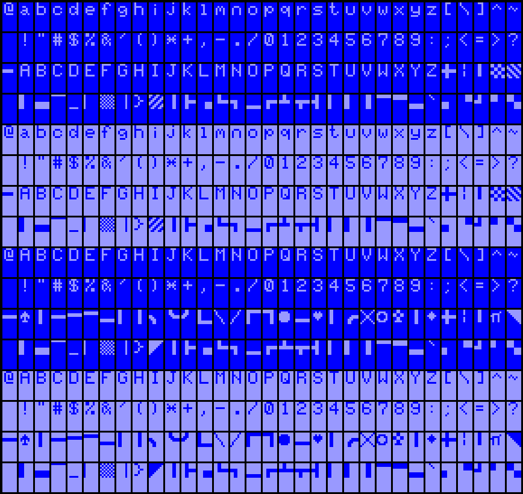
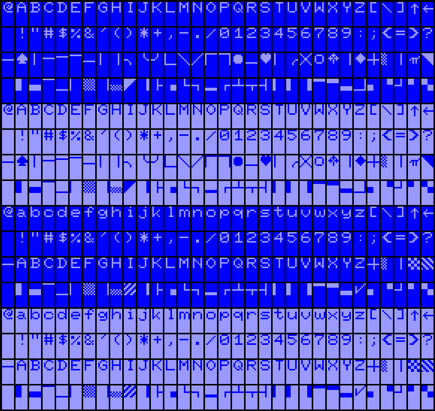
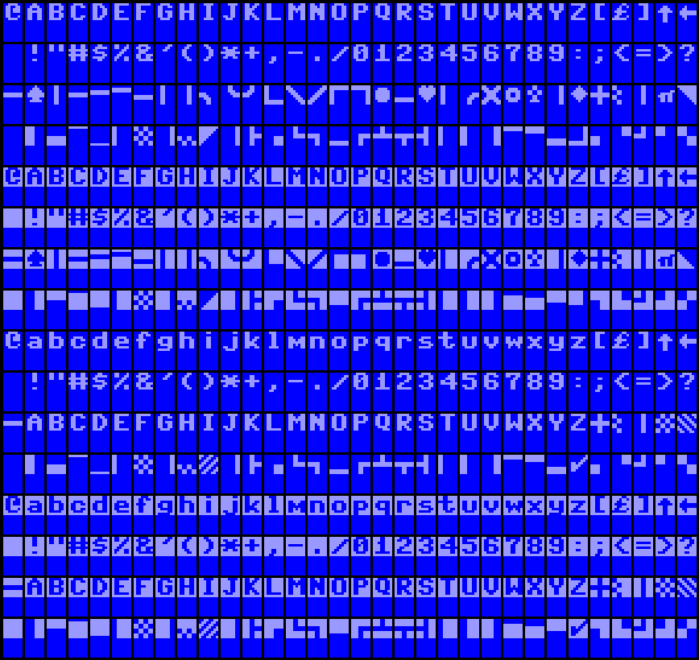
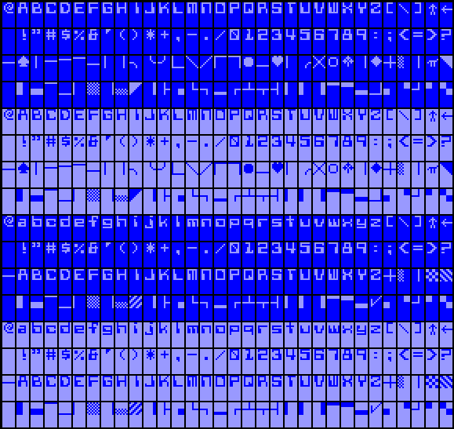
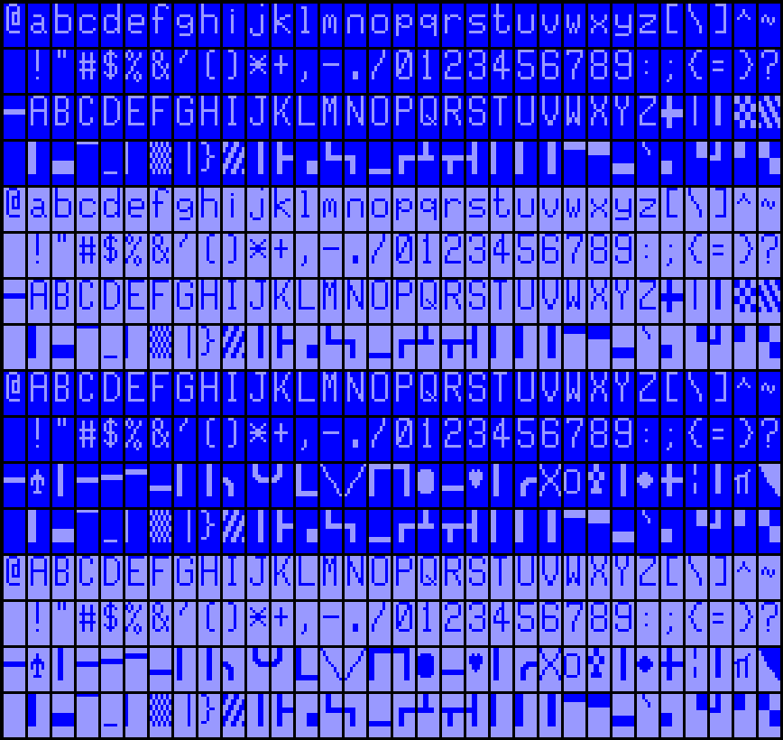
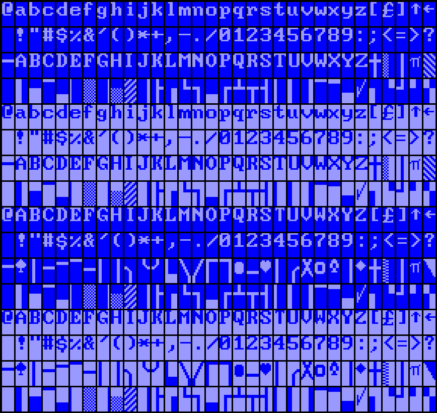
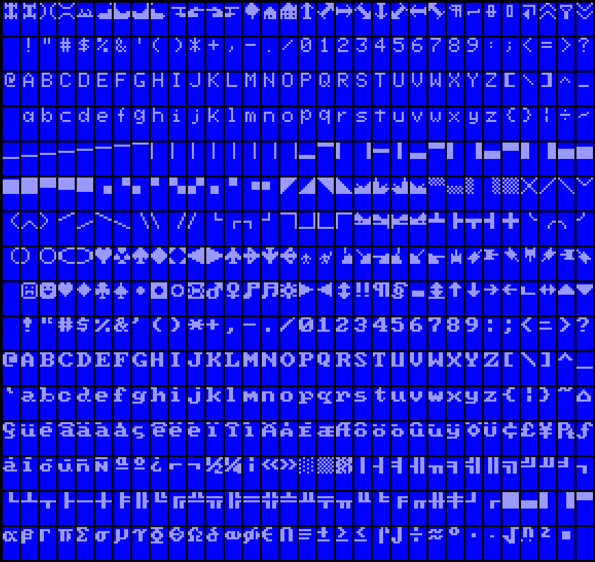
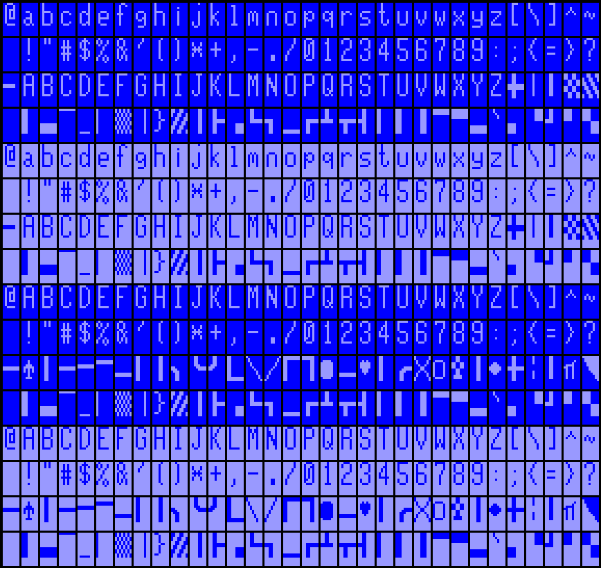

# Font ROM

Character sets for the VDC (U17).  Burn into a 27C512.

```text
$ cat 1.bin 2.bin 3.bin 4.bin 5.bin 6.bin 7.bin 8.bin > font1.bin
```

## 1.bin



## 2.bin



## 3.bin



## 4.bin



## 5.bin



## 6.bin



## 7.bin



## 8.bin


